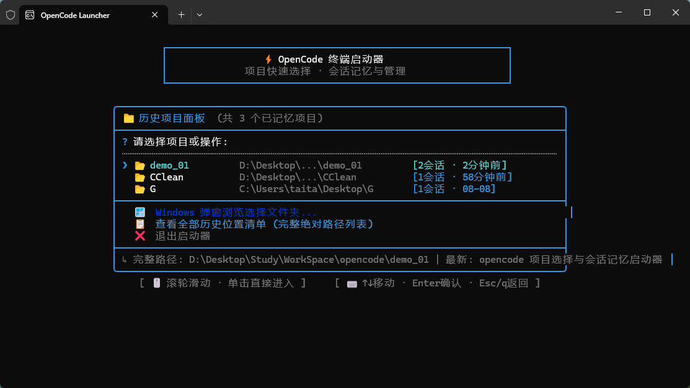
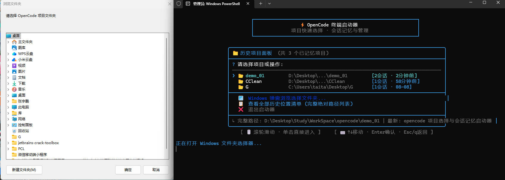
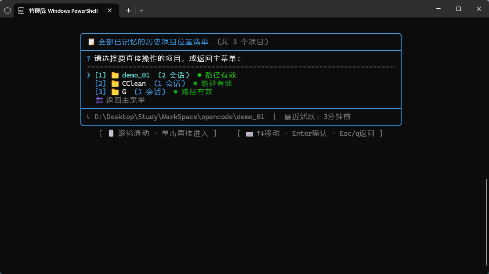
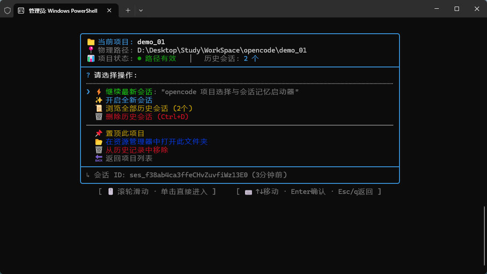
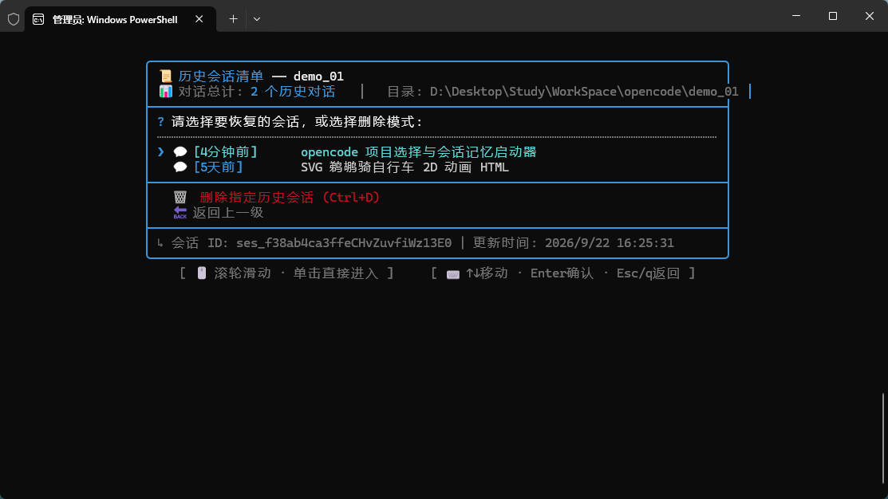

# OpenCode Launcher (ocl) 🚀

> 专为 **OpenCode** 打造的交互式项目记忆控制中心与终端启动器。  
> 告别反复 `cd` 寻找路径与敲击启动参数，一键检索历史项目、恢复会话、多窗口并发启动。

---

## ✨ 核心特性

- 🖱️ **原生 VT SGR 鼠标与滚轮驱动**  
  自主实现终端鼠标事件解析，支持鼠标滚轮逐行平滑滑动、鼠标左键单击直接进入，严密边界锁定，绝不发生首尾循环穿透。
- 📐 **列表高度随窗口动态伸缩 (Responsive Height)**  
  智能感知终端可视行数（`process.stdout.rows`），动态调整历史列表有效行高。拉大或全屏时自动撑满视野展示海量历史，缩小窗口时优雅收缩并提供滚动提示。
- 🪟 **独立新窗口拉起 & 控制中心常驻**  
  启动 OpenCode 时自动在全新的独立终端窗口（优先拉起现代 Windows Terminal，兼容标准 CMD）中运行，原启动器窗口保持在操作菜单，支持多项目、多窗口并发调度。
- 🧠 **项目智能聚类与原生数据库读取**  
  底层直连 OpenCode 本地 SQLite 数据库，秒级提取历史会话、创建与最后活跃时间、会话标题，自动识别项目路径有效性。
- 🗑️ **历史会话彻底删除 (原生对标 Ctrl+D)**  
  提供可视化的历史会话销毁功能，在启动器内即可一键永久清理不再需要的旧会话。
- 📌 **项目置顶与系统原生文件夹选择器**  
  常用项目一键置顶锁定在前排；点击即可唤起 Windows 原生图形文件夹选择对话框，选定任意新文件夹即刻加入记忆库。
- 📦 **独立免安装单文件打包 (Node.js SEA)**  
  内置构建系统，可一键将整个工程打包为单文件 `opencode-launcher.exe`，无需目标机预装 Node.js 环境，即开即用。

---

## 📸 运行效果截图 (按操作流程演示)

### 1. 主控制面板 (16:28:38)
> 极简现代的居中卡片布局，自动识别所有记忆项目、历史会话数与最近活跃状态；底部实时抽屉显示绝对路径与最新会话内容。



### 2. 原生文件夹选择器弹窗 (16:29:03)
> 支持一键唤起 Windows 原生图形选择窗口，点击即可将任意新项目目录加入启动器记忆库。



### 3. 全部已记忆项目清单与状态校验 (16:29:13)
> 清晰罗列所有曾访问的项目位置，实时标记路径有效性（● 路径有效 / ○ 路径已失效），列表高度随窗口高度自适应拉伸。



### 4. 项目专属操作控制面板 (16:29:22)
> 选定项目后直达操作中心：⚡ 继续最新会话、✨ 开启全新会话、📜 浏览历史、📌 置顶锁定、📂 资源管理器打开目录。



### 5. 历史会话恢复与彻底销毁清单 (16:29:37)
> 查看该项目下的全部历史对话与相对时间，支持单击直接恢复会话，或选择永久删除模式（对标 OpenCode Ctrl+D）。



---

## 🚀 快速启动

### 方式一：直接运行独立免安装版 (.exe)
无需安装 Node.js 环境，直接使用已打包好的可执行文件：
- 双击运行根目录或发布包中的 **`release/opencode-launcher.exe`**；
- 或双击桌面已生成的 **`OpenCode Launcher`** 快捷方式。

### 方式二：全局终端命令 (`ocl`)
若已通过 `npm link` 或全局安装：
```bash
ocl
```
即可在任意终端窗口中瞬间唤起控制中心！

### 方式三：开发者模式运行
```bash
# 1. 安装依赖
npm install

# 2. 以开发模式启动
npm run dev
```

---

## ⌨️ 操作指南

### 鼠标操作
| 操作 | 行为 |
| :--- | :--- |
| **滚轮向上滑动** | 项目 / 会话列表向上翻滚（顶部严格拦截防穿透） |
| **滚轮向下滑动** | 项目 / 会话列表向下翻滚（底部严格拦截防穿透） |
| **鼠标左键单击** | 直接选中并触发该行操作（项目、会话或底部按钮） |

### 键盘操作
| 按键 | 行为 |
| :--- | :--- |
| **↑ / ↓** 或 **k / j** | 逐项移动选中光标 |
| **PageUp / PageDown** | 每次快速翻动 5 项 |
| **Home / End** | 瞬间跳到列表最顶部 / 最底部 |
| **Enter** | 确认当前高亮选项 |
| **Esc / q** | 返回上一层菜单 |
| **Ctrl + C** | 彻底退出启动器并关闭当前终端窗口 |

---

## 🛠️ 命令行参数

```text
用法:
  ocl                          唤起启动器交互式主菜单
  ocl <目录路径>               记录并直接在指定目录下启动 OpenCode
  ocl --help, -h               显示帮助信息
  ocl --version, -v            显示版本号
```

**示例**：
```bash
ocl D:\Projects\MyAwesomeApp
```

---

## 📦 工程脚本与打包编译

本项目提供了完备的开发、类型检查、测试与免安装打包工具链：

```bash
# 检查 TypeScript 类型
npm run typecheck

# 运行数据读取与自适应算法自测
npm run test

# 编译为 CommonJS 包 (tsup)
npm run build

# 生成/更新桌面快捷方式 (OpenCode Launcher.lnk)
npm run shortcut

# 一键生成免安装单文件发布包 (EXE + ZIP)
npm run package
```

打包完成后将在 `release/` 目录下生成：
- **`opencode-launcher.exe`**：独立单文件可执行程序
- **`OpenCode-Launcher-Windows-x64.zip`**：便携发布压缩包

---

## 📂 数据存储说明

启动器设计严格遵循轻量与无侵入原则：
1. **OpenCode 会话数据源**：
   - 默认读取：`~/.local/share/opencode/opencode.db`
2. **启动器用户偏好设置**（置顶列表、自定义历史路径）：
   - 保存在：`~/.config/opencode-launcher/config.json`

---

## 📄 开源许可证

本项目采用 [MIT License](LICENSE) 开源。
